# Recipes

- [Bacon Marmalade Burgers](#bacon-marmalade-burgers)
- [Baklava](#baklava)
- [Cinnamon Rolls](#cinnamon-rolls)
- [Crunchwraps](#crunchwraps)
- [Doughnuts](#doughnuts)
- [Dumplings](#dumplings)
- [Fisn ‘N’ Chips](#fisn-n-chips)
- [Mommiyama](#mommiyama)
- [Oatmeal Chocolate Chip Cookies](#oatmeal-chocolate-chip-cookies)
- [Orange Chicken](#orange-chicken)
- [Philly Cheesesteaks](#philly-cheesesteaks)
- [Pizza](#pizza)
- [Stromboli](#stromboli)

## Bacon Marmalade Burgers

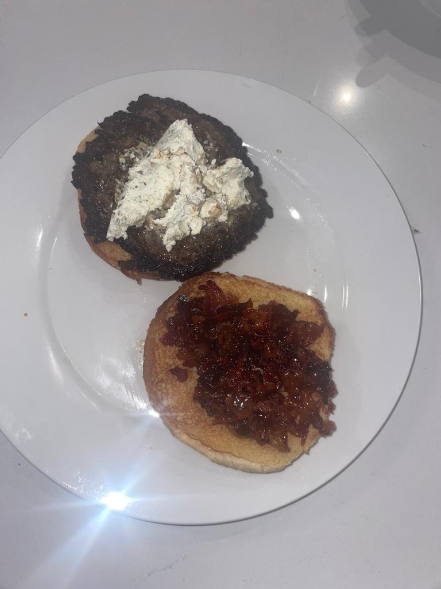

### Ingredients

- $2$ lbs ground beef, portioned into $8$ burgers and seasoned with salt
  and pepper
- $1$ lb thick cut bacon
- $1$ sweet onion, slivered
- $\frac{1}{2}$ cup brown sugar
- $8$ sesame seed buns
- $1$ pkg [Alouette cheese
  spread](https://www.kroger.com/p/alouette-garlic-herb-soft-spreadable-cheese/0007144830014?fulfillment=PICKUP&storecode=01600621&&cid=shp_adw_shopl_.FY23.01_search_ent_conv_lia_corelia_kroger_g_lia_shop_acq_evgn_ship_all_roas_deli&gclid=Cj0KCQiA6rCgBhDVARIsAK1kGPJxmr-45Ox-J_PqG65vHUoXBX-TFPwEPjpnpYg4Po-GhQAFiM1vPgoaAnAeEALw_wcB&gclsrc=aw.ds)

### Directions

1.  Cut bacon into small pieces and cook in a skillet over medium-high
    heat until crispy (about $8$ minutes).
2.  Remove bacon from skillet, but leave $2$ tbsp of bacon grease in the
    pan to cook the onions. Add slivered onions to the same skillet and
    cook for $8$ minutes.
3.  Reduce the heat to low so the onions can caramelize. Add
    $\frac{1}{2}$ cup brown sugar and continue to cook them until they
    completely caramelize (about $20$ minutes).
4.  Add the bacon bits back into the caramelized onions.
5.  Smash each burger portion very thin (I use the underside of a pan)
    and cook for about $1\frac{1}{2}$ minutes per side.
6.  Serve by putting a burger on a toasted bun and adding bacon
    marmalade and alouette cheese spread.

## Baklava

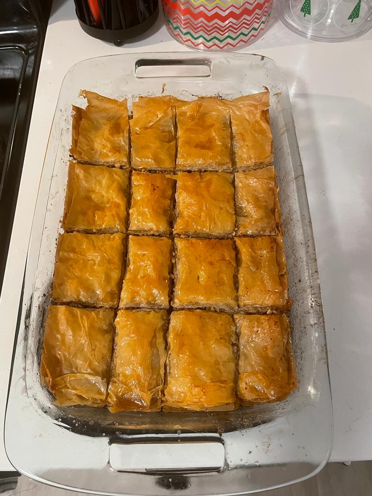

### Ingredients

### Directions

## Cinnamon Rolls

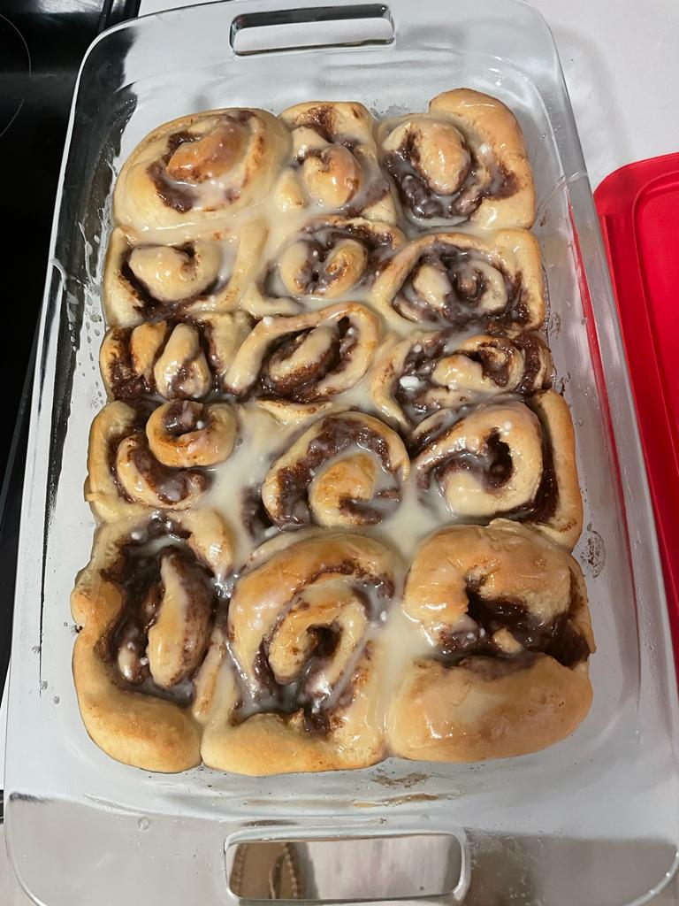

### Ingredients

##### Dough

- $1$ loaf frozen [bread
  dough](https://rhodesbakenserv.com/white-bread-2/), thawed

##### Filling

- $\frac{1}{2}$ cup light brown sugar
- $\frac{1}{4}$ cup white sugar
- $6$ tbsp butter
- $2$ tbsp cinnamon

##### Cream Cheese Icing

- $2$ oz Philadelphia cream cheese
- $3$ tbsp butter
- $3$ cups confectioners sugar (AKA powdered sugar)
- $6$ tbsp milk
- $\frac{3}{4}$ tsp vanilla extract

**Note**: This makes **a lot** of cream cheese icing.

##### Glaze Icing

- $2$ cups confectioners sugar (AKA powdered sugar)
- $4$ tbsp melted butter
- $1$ tsp vanilla extract
- $3-6$ tbsp hot water

### Directions

1.  Thaw bread dough in refrigerator overnight (per instructions on
    package). Take it out of the refrigerator about an hour before using
    it so that it isn’t stiff.
2.  Roll dough into a flat rectangle.
3.  Combine filling ingredients in a large bowl, and spread evenly onto
    the flattened dough.
4.  Roll dough into a a cylinder and cut into $1$” pieces. I like to do
    this by repeatedly cutting the pieces in half until they are about
    the right size.
5.  Bake at $350^\circ F$ for $25$ minutes.
6.  Immediately after coming out of the oven, cover with icing of choice
    from above.

## Crunchwraps

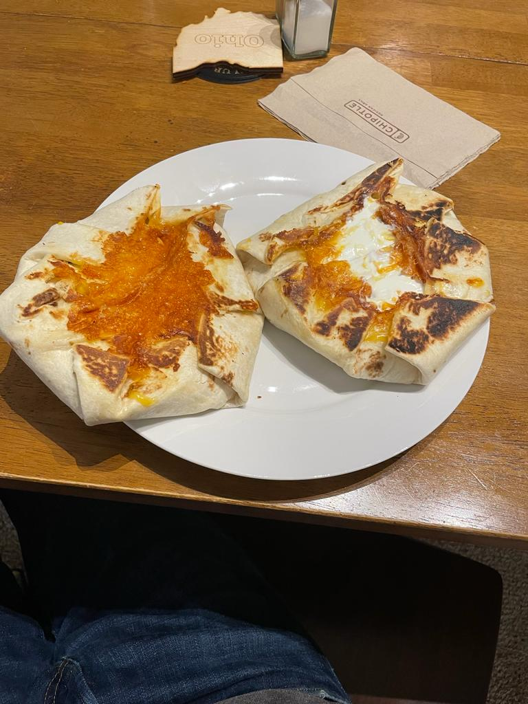

### Ingredients

**Note**: The ingredients can vary. This recipe has the ingredients I’ve
used most often.

- $1$ lb ground beef
- $1$ package taco seasoning (I like Taco Bell brand)
- $12$” flour tortillas
- shredded cheese
- canned nacho cheese
- tostadas
- sour cream
- diced tomatoes (I like to use Roma, since they’re cheapest per pound)
- taco sauce

### Directions

1.  Cook ground beef in a skillet over medium heat. Add taco seasoning
    at the end (per packet instructions).
2.  Heat nacho cheese ina small saucepan.
3.  Place ground beef in the ceter of a warmed tortilla (I microwave the
    tortillas for $30$ seconds to make them less likely to break).
4.  Add nacho cheese, taco sauce, sour cream, tomatoes then top with a
    tostada shell. Add shredded cheese. **It is important that the
    shredded cheese is the last thing added, since it will be the glue
    that holds the crunchwrap together.**
5.  Fold the edges of the tortilla up around the tostada and shredded
    cheese.
6.  Cook the crunchwrap seam-side down for $3$ minutes. Then flip and
    cook an additional $1$ minute.

## Doughnuts

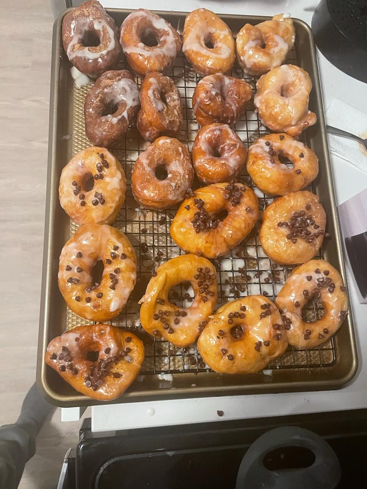

### Ingredients

##### Dough

- $1$ loaf frozen [bread
  dough](https://rhodesbakenserv.com/white-bread-2/), thawed
- cinnamon sugar

##### Glaze

- $2$ cups confectioners sugar (AKA powdered sugar)
- $4$ tbsp melted butter
- $1$ tsp vanilla extract
- $3-6$ tbsp hot water

### Directions

1.  Thaw bread dough in refrigerator overnight (per instructions on
    package). Take it out of the refrigerator about an hour before using
    it so that it isn’t stiff.
2.  Roll dough into a flat rectangle. Using a drinking glass, cut
    circles out of dough. Using the cap of a plastic disposable water
    bottle, cut out small holes in the middle of each doughnut.
3.  Roll scraps into a new flat rectangle and cut out more doughnuts
    until there is no dough left.
4.  Fill a pot with about $2$ inches of vegetable oil and heat to
    $350^\circ F$. **If the oil is too hot, the doughnuts will burn.**
    Cook doughnuts for $1-2$ minutes per side, until golden brown. Cook
    in batches to avoid overcrowding the pot.
5.  Immediately after removing the doughnuts from the oil, dip in glaze,
    and add additional toppings of choice. I like to coat with cinnamon
    sugar.

## Dumplings

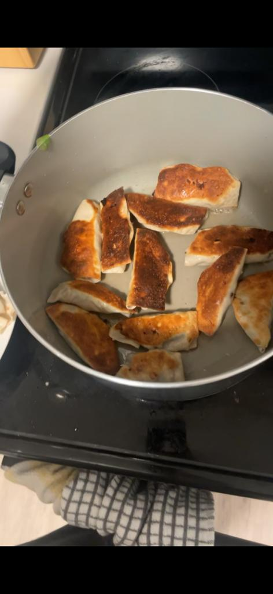

### Ingredients

### Directions

## Fisn ‘N’ Chips

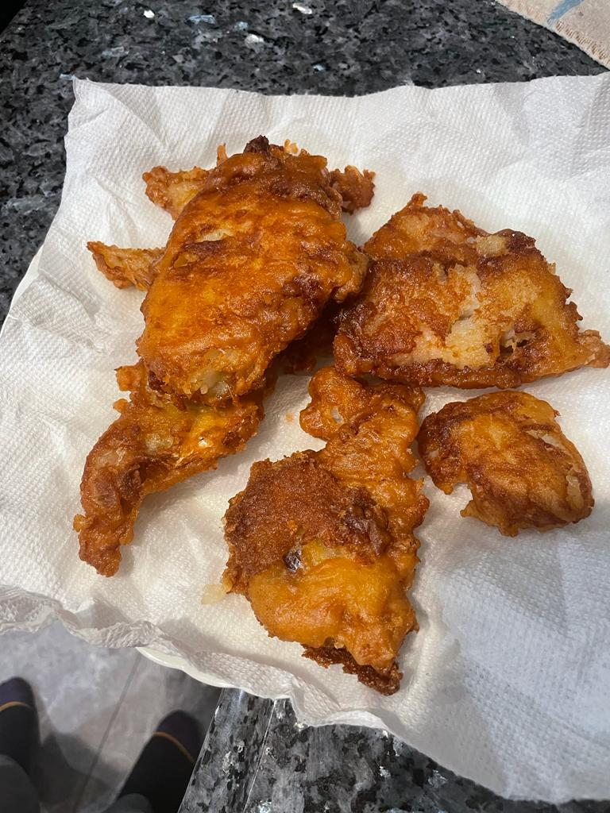

### Ingredients

- $1$ cup all-purpose flour, chilled
- $1$ tsp baking powder
- $1$ tsp salt
- $1\frac{1}{4}$ cups **VERY COLD** light beer (I normally use Bud
  Light)
- $1\frac{1}{2}$ lbs cod, haddock, or other white fish cut into strips
  (I normally use cod)
- oil for frying

### Directions

1.  Combine $1$ cup all-purpose flour and $1$ tsp salt i a large bowl.
    Add $1\frac{1}{4}$ cups **VERY COLD** light beer and whisk until
    smooth. Use the batter immediately.
2.  Blot strips of fish with paper towels to remove excess moisture.
    Coat each piece of fish with flour and thoroughly coat them with
    beer batter.
3.  Fill a pot with $1$” of oil and heat it to $350^\circ F$.
4.  Fry the fish for about 3 minutes per side or until golden brown and
    crunchy.

## Mommiyama

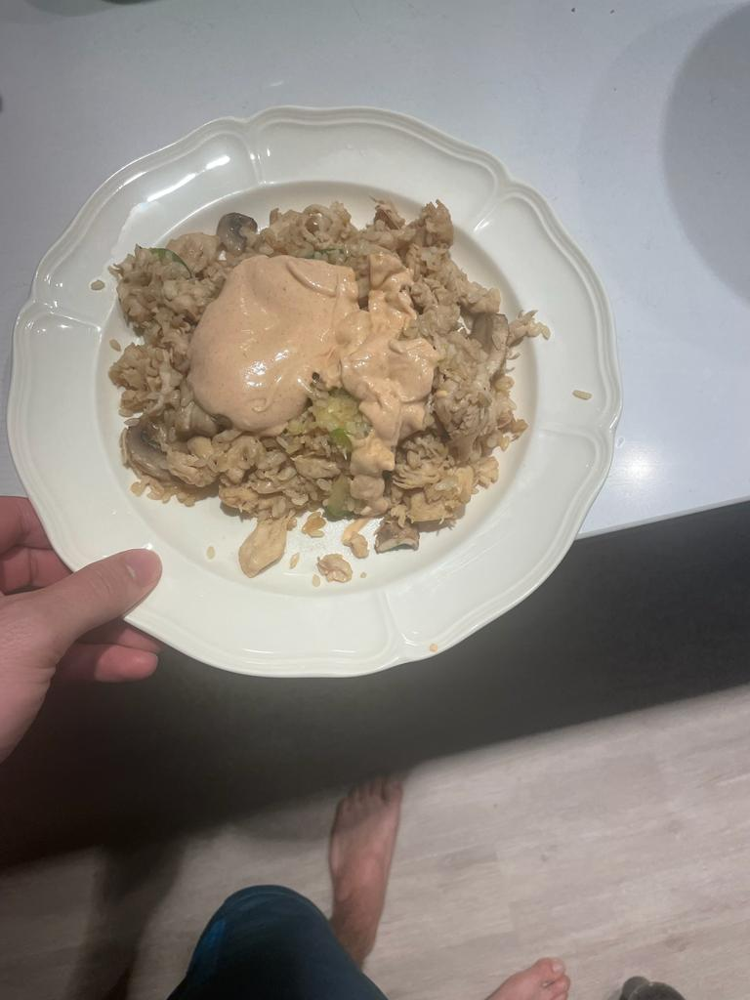

### Ingredients

#### Yum Yum Sauce

**Note**: I normally double the yum yum sauce recipe.

- $1 \frac{1}{4}$ cups mayonnaise
- $\frac{1}{4}$ cup water
- $1$ tbsp melted butter
- $1$ tsp tomato paste
- $1$ tsp white sugar
- $\frac{1}{2}$ tsp garlic powder
- $\frac{1}{4}$ tsp paprika
- $1$ pinch cayenne pepper

#### Fried Rice

- $1$ cup rice
- $1$ lb chicken tenderloin (don’t use breasts or thighs)
- $1$ large zucchini
- $1$ container of white mushrooms
- Soy sauce to taste

### Directions

## Oatmeal Chocolate Chip Cookies

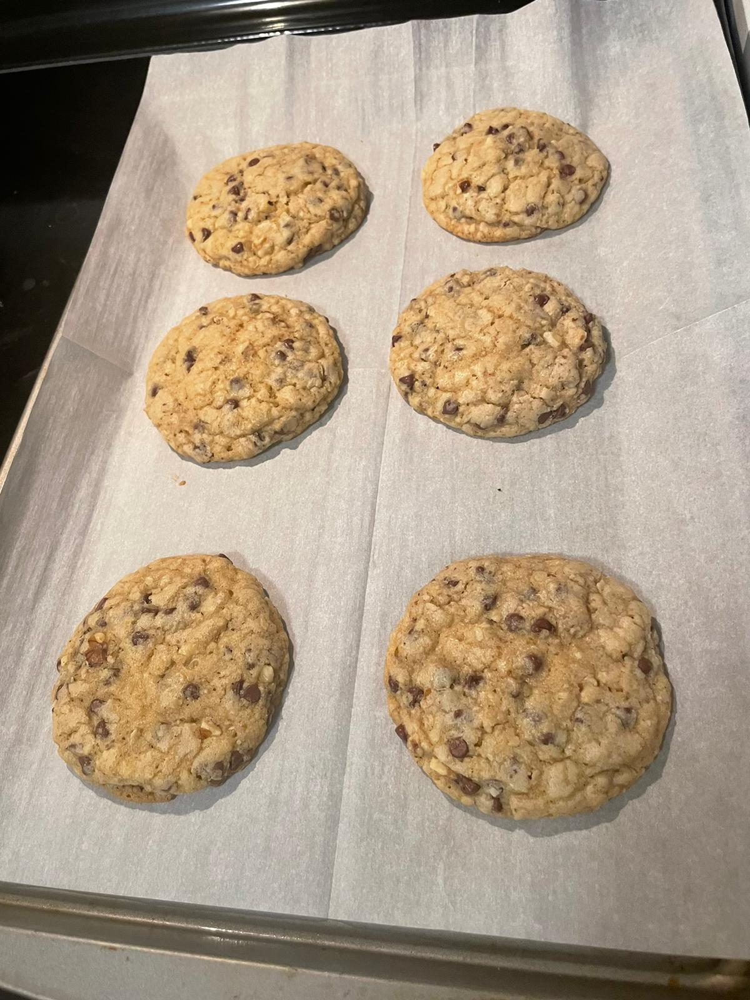

### Ingredients

- $\frac{1}{2}$ lb unsalted butter (2 sticks)
- $\frac{3}{4}$ cup + 1 tbsp white sugar
- $\frac{3}{4}$ cup light brown sugar
- $2$ eggs
- $1\frac{1}{4}$ tsp vanilla extract
- $\frac{1}{4}$ tsp lemon juice
- $2\frac{1}{4}$ cup flour
- $\frac{1}{2}$ cup rolled oats (or use flour if you don’t have oats)
- $1$ tsp baking soda
- $1$ tsp salt
- $1$ pinch cinnamon
- $2\frac{2}{3}$ cups Nestle Tollhouse semi-sweet chocolate chips
- $1\frac{3}{4}$ cups chopped walnuts

**Note**: I normally skimp on the chocolate chips and walnuts

### Directions

1.  Cream $\frac{1}{2}$ lb unsalted butter (2 sticks), $\frac{3}{4}$
    cup + 1 tbsp white sugar, and $\frac{3}{4}$ cup light brown sugar
    until thoroughly combined. If you don’t have an electric mixer, it’s
    easiest to do this by cutting the butter into small cubes and using
    a wooden spoon to work it into the sugar.
2.  Add $2$ eggs, $1\frac{1}{4}$ tsp vanilla extract, and $\frac{1}{4}$
    tsp lemon juice and mix until light and fluffy.
3.  Add $2\frac{1}{4}$ cup flour, $\frac{1}{2}$ cup rolled oats, $1$ tsp
    baking soda, $1$ tsp salt, and $1$ pinch cinnamon and stir to
    combine.
4.  Stir in $2\frac{2}{3}$ cups Nestle Tollhouse semi-sweet chocolate
    chips and $1\frac{3}{4}$ cups chopped walnuts.
5.  Portion dough with an ice cream scoop (about $3$ tbsp) and roll into
    tall cylinders. To make the dough less sticky, it is helpful to
    refrigerate it for $30$ minutes prior to portioning.
6.  Let portioned dough freeze overnight.
7.  Line a baking sheet with parchment paper. **Do NOT use cooking
    spray. It will make the dough flatten too much.**
8.  Bake at $300^\circ F$ for $22$ minutes. Let cool for 30 minutes to
    allow cookies to set.

## Orange Chicken

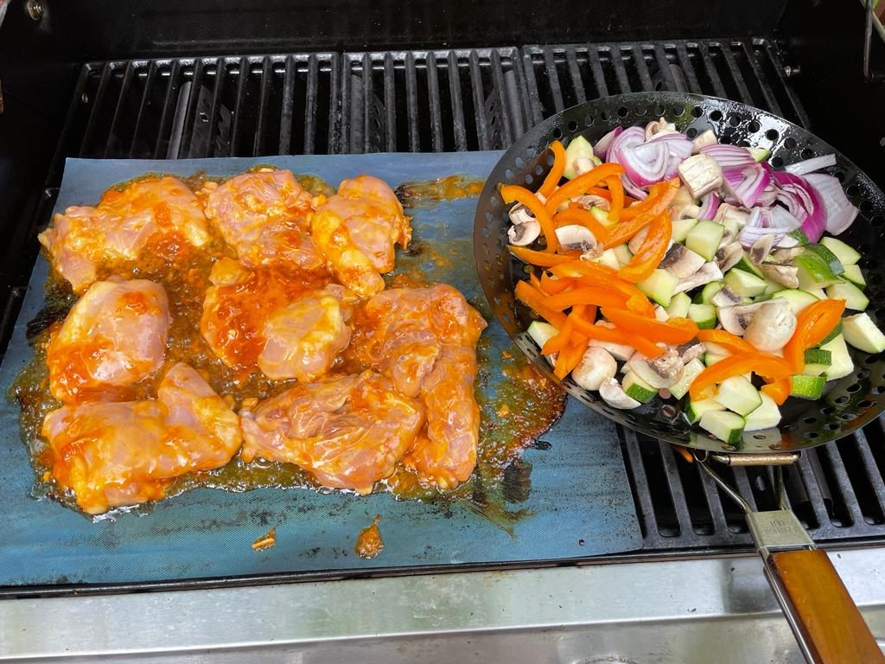

### Ingredients

### Directions

## Philly Cheesesteaks

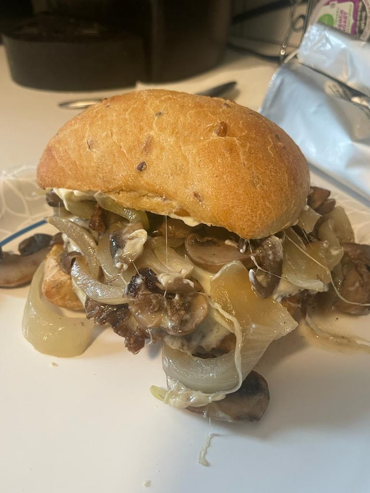

### Ingredients

- $1$ pkg [Stehouwer’s Beef
  Sizzlers](https://www.walmart.com/ip/Stehouwer-s-Beef-Sizzlers-16-oz/12444155?wmlspartner=wlpa&selectedSellerId=0&wl13=3792&adid=2222222227712444155_117755028669_12420145346&wmlspartner=wmtlabs&wl0=&wl1=g&wl2=c&wl3=501107745824&wl4=pla-294505072980&wl5=9014909&wl6=&wl7=&wl8=&wl9=pla&wl10=8175035&wl11=local&wl12=12444155&wl13=3792&veh=sem_LIA&gclid=Cj0KCQiA6rCgBhDVARIsAK1kGPLtGEpt4GcZP9BgH2pD2lhk87R74pOzj_f4mz5YEoeKXbJI4AgQBMcaAsEdEALw_wcB&gclsrc=aw.ds)
  ($16$ oz)
- cheese (either provolone slices or [Cheez
  Whiz](https://www.kroger.com/p/cheez-whiz-original-cheese-dip/0002100062679?fulfillment=PICKUP&storecode=01600621&&cid=shp_adw_shopl_.FY23.01_search_ent_conv_lia_corelia_kroger_g_lia_shop_acq_evgn_ship_all_roas_dairy+%26+eggs&gclid=Cj0KCQiA6rCgBhDVARIsAK1kGPL4I8z0c4U9uIh-kwabKSiPF03P-3UaSNVWdPkaldM9C_ePT0Fj96UaAh4VEALw_wcB&gclsrc=aw.ds))
- $1$ sweet onion
- $1$ pkg mushrooms
- $6$ sturdy rolls (I like to use ciabatta)
- mayonnaise

### Directions

1.  Cook beef sizzlers according to package instructions. If using
    provolone cheese, add once slice to each sizzler $30$ seconds before
    it is done cooking.
2.  Cook onions and mushrooms until tender. If using Cheez Whiz, add $2$
    tbsp of Cheez Whiz to the onions and mushrooms after they are done
    cooking.
3.  Toast ciabatta roll. Add mayo, top with a beef sizzler, and add
    onions and mushrooms.

## Pizza

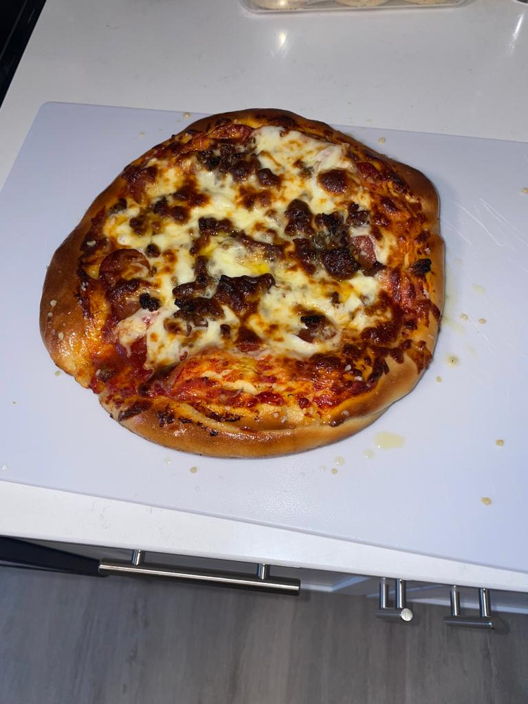

### Ingredients

**Note**: I often change the toppings. This recipe is for a pepperoni
pizza.

- $1$ loaf frozen [bread
  dough](https://rhodesbakenserv.com/white-bread-2/), thawed
- $2$ tbsp butter
- $1$ clove garlic, minced
- 1 can of [crushed
  tomatoes](https://www.kroger.com/p/kroger-crushed-peeled-tomatoes/0001111081548?fulfillment=PICKUP&storecode=01600621&&cid=shp_adw_ob.shopl_.FY23.01_search_ob_conv_ob_ourbrandslia_kroger_g_lia_shop_acq_evgn_ourbrandskro_all_roas_pantry&gclid=Cj0KCQiA6rCgBhDVARIsAK1kGPJTC27H3CNUmDvO_c5MoTBXGexWol5TnGe6U_UR83V7j9LA5Ir96EcaAq5OEALw_wcB&gclsrc=aw.ds).
  Get the smallest can you can find. I normally get 15 oz, and that is
  too much for $1$ pizza.
- $3$ tbsp sugar
- $8$ oz fresh mozzarella, sliced thick
- $8$ oz pepperoni. I like to buy a stick and cut the pepperonis thick.
  That way they curl and get crispy in the oven.

### Directions

1.  Thaw bread dough in refrigerator overnight (per instructions on
    package). Take it out of the refrigerator about an hour before using
    it so that it isn’t stiff.
2.  Spray a $10$” cast iron skillet with cooking spray and form the
    dough to the shape of the skillet.
3.  To make pizza sauce add $3$ tbsp sugar to the can of crushed
    tomatoes.
4.  Spread sauce on dough, add mozzarella slices and pepperoni.
5.  Bake at $500^\circ F$ for 15 minutes. Then broil on high for 2
    minutes until cheese is golden brown and pepperonis are crispy.
6.  Add garlic and $2$ tbsp butter to a bowl and melt in the microwave.
    Spread the garlic butter on the pizza crust.

## Stromboli

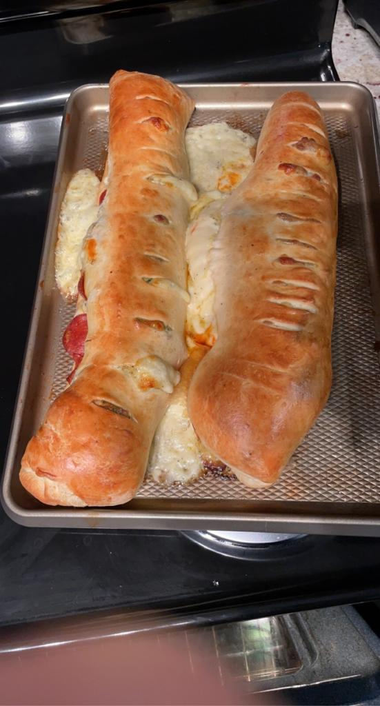

### Ingredients

**Note**: This makes one roll of Stromboli. I normally double the recipe
and make 2.

- $1$ loaf frozen [bread
  dough](https://rhodesbakenserv.com/white-bread-2/), thawed
- $8$ oz pepperoni
- $6$ oz mozzarella cheese slices
- $3$ oz provolone cheese slices
- $1$ tbsp Parmesan cheese
- $2$ eggs (separate yolks from whites)
- $\frac{1}{2}$ tsp garlic powder
- $1$ tsp oregano (I normally use Italian seasoning, which has oregano)
- $\frac{1}{2}$ tsp pepper
- $2$ tbsp cooking oil
- $1$ tsp parsley (dried from spice aisle)
- marinara sauce for dipping

### Directions

1.  Thaw bread dough in refrigerator overnight (per instructions on
    package). Take it out of the refrigerator about an hour before using
    it so that it isn’t stiff.
2.  Roll bread dough into $12$” by $18$” rectangle. Line a baking sheet
    with parchment paper so the bottom of the Stromboli doesn’t burn.
3.  In a bowl, combine $2$ egg **yolks**, $1$ tbsp Parmesan cheese,
    $\frac{1}{2}$ tsp garlic powder, $1$ tsp oregano, $\frac{1}{2}$ tsp
    pepper, $1$ tsp parsley, $2$ tbsp cooking oil.
4.  Spread the spice and egg mixture (from previous step) onto the $12$”
    by $18$” rectangle of dough. Cover with $3$ oz provolone cheese
    slices, $6$ oz mozzarella cheese slices, and $8$ oz pepperoni.
5.  Roll into a cylinder and brush exterior with egg whites. Cut slits
    in the top of the rolled cylinder and top with oregano.
6.  Bake seam side down at $350^{\circ}F$ for $30$ minutes.
